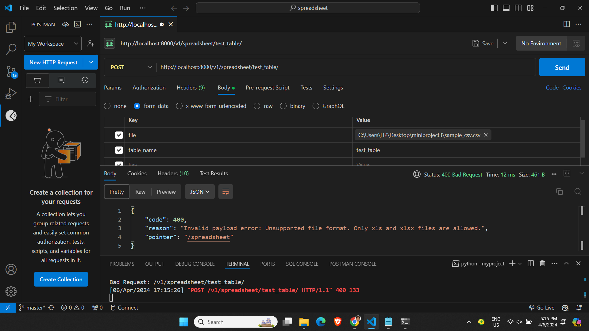

# spreadsheet-sql-mapper



### Functionality
- This Django RESTful API application accepts POST requests containing:
  - A spreadsheet file (uploaded through the request body)
  - A table name (specified as a parameter in the request)
    
- The application performs the following actions:
  - **File Validation:**
    - Checks if the uploaded file is a valid spreadsheet (.xls or .xlsx extension).
    - Rejects requests with unsupported file formats or empty files.
  - **Data Validation:**
    - Verifies that the uploaded spreadsheet contains no blank cells. This ensures data integrity during import.
    - Returns an error message if blank cells are detected.
  - **Table Management:**
    - Checks if a table with the specified name already exists in the database.
    - If the table doesn't exist, the application creates a new table with appropriate columns based on the spreadsheet data structure.
  - **Data Import:**
    - Parses the spreadsheet content using pandas.
    - Inserts the extracted data into the newly created or existing table.
    - Handles potential data type mismatches or errors during insertion gracefully (e.g., logging errors or returning specific error messages).

### Project Prerequisites
- Python 3.12.2
- Django 5.0.2
- Django REST Framework
- Pandas

### Setting up the Repository
1. Clone the repository.
```
git clone https://github.com/johnfritzel/spreadsheet-sql-mapper.git
```

2. Navigate to the project directory.
```
cd spreadsheet-sql-mapper
cd myproject
```

3. Create a virtual environment and activate it.
```
python -m venv <name of virtual environment>
venv\Scripts\activate
```

4. Install the required packages.
```
pip install -r requirements.txt
```

5. Apply migrations to set up the database.
```
python manage.py makemigrations
python manage.py migrate
```

6. Start the development server.
```
python manage.py runserver
```
